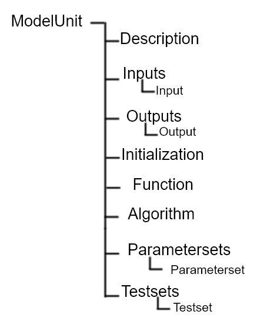
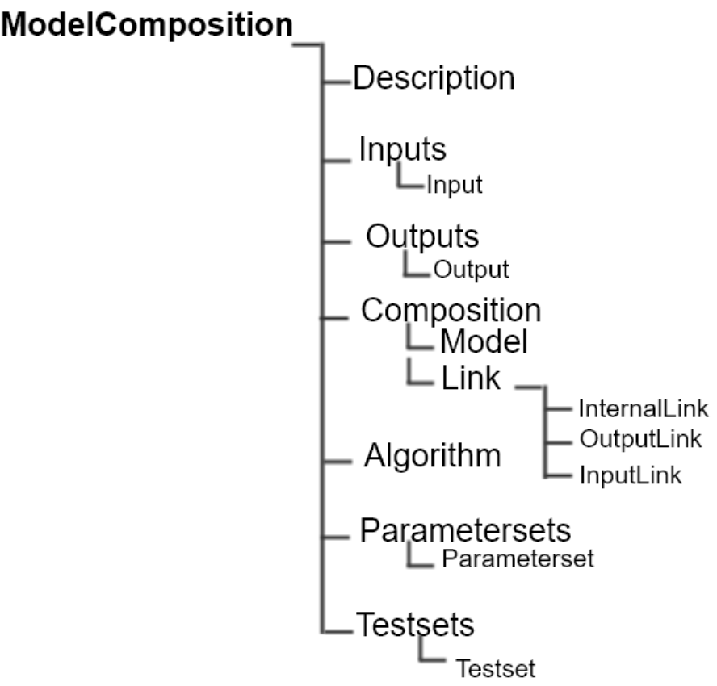

**Crop2ML Description**
=======================
| In Crop2ML, a model is either a model unit or a composition of models. A ModelUnit  represents the atomic unit of a crop model define by the 
	modelers. A model composition  is a model resulting from the composition of two or more atomic model or composite models.
| These models have a specific formal definition in Crop2ML.

Formal definition of a Model Unit in Crop2ML
--------------------------------------------
| The structure of a Model Unit in Crop2ML MUST be conform to a specific Document Type Definition
	named `ModelUnit.dtd <https://github.com/AgriculturalModelExchangeInitiative/Crop2ML/blob/master/ModelUnit.dtd>`_ .
| So a Model Unit Crop2ML document is a XML document well-formed and also obeys the rules given in the ModelUnit structure.
| This structure MAY be described by the below tree:

.. csv-table::
   :header: "Element", "Description"
   :widths: 25, 100
   
   "ModelUnit", " The root of an atomic model in Crop2ML which make the difference from a composite model."
   "Description", " Some basic information related to the name of the model, its authors and others elements used to reference it."
   "Inputs", " A list of inputs characterized by their names, initial states, the range of values and others. Its input variables are related to climate, soil and cropping system"
   "Outputs", " A list of outputs defining the processes involved, the variables whose dynamics we want to observe."
   "Initialization", " A process used to attribute an initial value to the state, rate and auxiliary variables. "
   "Function", " A service called by an atomic or composite model for a specific action. "
   "Algorithm", " The description of the behaviour of the model made by the mathematical relationship between the inputs and the outputs with some control structure."
   "Parametersets", " Some sets of parameters which are invariant and used for the simulation of the models."
   "Testsets", " Set of model configuration used to compare estimated and desired outputs  ."

| In the next, we define the major elements of a Crop2ML model unit.

ModelUnit element
^^^^^^^^^^^^^^^^^
| An atomic model in Crop2ML is declared with `<<ModelUnit>> <https://github.com/AgriculturalModelExchangeInitiative/PyCrop2ML/blob/master/src/pyCrop2ML/modelunit.py>`_ element,
	the usual root of Crop2ML ModelUnit document.
	
.. code-block:: xml

		<?xml version="1.0" encoding= ?> (1)
		<!DOCTYPE ModelUnit PUBLIC " " "https://raw.githubusercontent.com/AgriculturalModelExchangeInitiative/crop2ml/master/ModelUnit.dtd"> (2)
		<ModelUnit modelid=" " timestep=" " name=" " version=""> (3)
			....
		</ModelUnit>

| (1) XML header with version 1.0 and "utf-8" encoding

| (2) External DTD declaration in the file

| (3) ModelUnit element MUST have an modelid and name attributes which are used to reference an atomic model. It MUST also contain a timestep attribute to define the temporality of the model and
   a version attribute for each version of the model.

* By given the generation of compute code is a process of Crop2ML project, the name of model must be valid 
      as a function or class name in a programming language. The name attribute value must obey a number of constraints:
         - it will start by a letter
         - in a single word
         - only alphanumeric characters and underscore characters
            eg: name: CropHeatFlux or crop_heat_flux (valid names),
            name: crop-heat-flux or 1cropheatflux (not valid names)

* modelid is composed by the name of the model package and the name of the model unit separated by a dot. It is used to reference the model elsewhere and must be an unique identifier.
   **Eg**. **SQ.EnergyBalance.CropHeatFlux** where SQ.EnergyBalance is the name of the package and CropHeatFlux the name of the model unit

* timestep is an integer variable which means the frequency of execution of model unit. 

* version corresponds to a state of evolution of the model unit. It is defined by numbering.

* Crop2ML modelUnit element MUST also contain Inputs, Outputs, Description, an Algorithm, Parametersets and Testsets elements and MAY optionally Initialization and Function elements. The restriction of the length of different lists of inputs and outputs is not imposed.

	
Description element
^^^^^^^^^^^^^^^^^^^
This element gives the general information on the model and is composed by a set of character elements. It MUST contain
Title, Authors, Institution and abstract elements and MAY optionally contain URI and Reference elements.

.. code-block:: xml
		
		<ModelUnit modelid=" " timestep=" " name=" " version =" ">
			<Description>
				<Title>title</Title>
				<Authors>authors</Authors>
				<Institution>institution</Institution>
				<Reference>reference</Reference>
				<Abstract><![CDATA[abstract]]></Abstract>
			</Description>
			...
		</ModelUnit>

* Title is the explicit name of the model and is based on no constraint. It gives the meaning of the process.
* Authors are the authors of the implemented model in a specific platform.
* Reference may inform about the platform in which the model is implemented. So, version of model in Crop2ML must evolve with its version in the platform.
   Reference can also provides the names of authors which emitted the physiology process hypothesis and the link of documentation. 
* Abstract describes briefly the process implemented.

Inputs elements
^^^^^^^^^^^^^^^
The inputs of Model are listed inside an XML element called Inputs within a `dictionary structure  <https://github.com/AgriculturalModelExchangeInitiative/PyCrop2ML/blob/version2/src/pyCrop2ML/inout.py>`_ 
composed by their attributes which declarations are optional(default, max, min, parametercategory, variablecategory and uri) or required(name, datatype, description, inputtype,
unit ) and their corresponding value. *Inputs* element MUST contain one or more *Input* elements.

.. code-block:: xml

      <ModelUnit modelid=" " timestep=" " name=" " version =" ">
         ...
         <Inputs>
            <Input name=" " description=" " variablecategory=" " datatype=" " min=" " max=" " default=" " unit=" " uri="" inputtype="variable"/>
            <Input name=" " description=" " parametercategory=" " datatype=" " min=" " max=" " default=" " unit=" " uri=" " inputtype="parameter"/>
            ...
         </Inputs>
         ...
      </ModelUnit>

* The required *datatype* attribute is the type of input value specified in *default* (the default value in the input), *min* (the minimum value in the input) and *max* (the maximum value in the input). A set of
   types is defined in Crop2ML as:
    - STRING to manipulate string variables, eg: phenology development stade "Anthesis"
    - DATE : A convention used to express date is dd/mm/yyyy where dd is the day, mm the month and yyyy the year. eg: "15/12/2007"
    - DOUBLE: a real number with a decimal eg (15.0 not 15)
    - INT: an integer number
    - BOOLEAN: A boolean variable takes one of these two values "TRUE" or "FALSE"
   Array variables have fixed length which values are between "[" and "]" brackets:
    - STRINGARRAY: an array of string variables.
    - DOUBLEARRAY: an array of real variables
    - INTARRAY: an array of integer variables
    - DATEARRAY: an array of dates variables 
    - BOOLEANARRAY: an array of boolean variables
   List variables have variable length which values are between "[" and "]" brackets:
    - STRINGLIST: a list of string variables
    - INTLIST: a list of integer variables
    - DOUBLELIST: a list of real variables
    - BOOLEANLIST: a list of boolean variable 
    - DATELIST: a list of date variable
   

* The *inputtype* attribute makes it possible to distinguish the (state, rate, auxiliary) variables and the parameters of the model. So it MUST take one of two possible values: *parameter* and *variable*.
   Parameter value is constant during a simulation while variable value is changed at each time step.

* The *parametercategory* attribute defines the category of parameter which is specified by one of the following values: *constant*, *species*, *soil* and *genotypic*.
   - Constant ParameterCategory is the category that does not depend on the species, the soil ang genotypic traits. Eg: Avogadro constant, latitude
   - soil parameterCategory is related to soil properties, eg : soil water retention
   - species parameterCategory is related to species properties: Response of vernalization rate to temperature
   - genotypic parameterCategory is related to the genotype

* The *variablecategory* attribute defines the category of variable depending on whether it is a *state*, a *rate* or an "auxiliary" variable. 
   - State variables characterize the behavior of the model. They result from the exchange processus in the system.
   - Rate variables characterizes the flux of these exchanges 
   - Auxiliary variables may be the intermediate product or other. So state variables are calculated in the model, but sometimes it can be provided as an auxiliary variables. 

* Unit attribute MUST be associated to inputs and outputs declaration. Crop2Ml project uses by default the `Unit Ontology <http://www.foodvoc.org/page/om-1.8>`_ (Version 2.0) developed by WUR.
   Symbol defined in this ontology is used to express unit of variables and parameters. 

|  Eg: unit of Temperature is "°C",
|  unit of thermal time is "°C d", d represents "day".
|  Units that compose composite unit are separated by space.
|  If an input have no unit, unit is expressed by : unit ="".
 
* Other attributes min and max may be used to implement tests of pre- and post-conditions depending to the target platform.
   They indicate the range of input variables and constitute a part of composability criteria of model.

Outputs element
^^^^^^^^^^^^^^^
The outputs of Model are listed inside an XML element called Outputs within a `dictionary structure <https://github.com/AgriculturalModelExchangeInitiative/PyCrop2ML/blob/version2/src/pyCrop2ML/inout.py>`_  
composed by their attributes which declarations are:

*    optional(variablecategory and URI) 

*    required(name, datatype, description, unit, max and min ) 

*	 and their corresponding value

*Outputs* MUST contain zero or more output elements. 

.. code-block:: xml

      <ModelUnit modelid=" " timestep=" " name=" " version =" ">
         ...
         <Outputs>
            <Output name=" " description=" " datatype=" " min=" " max=" "  unit=" " uri=" "/>
            <Output name=" " description=" " datatype=" " min=" " max=" "  unit=" " uri=" "/>
            ...
         </Outputs>
         ...
      </ModelUnit>

| The definition of different attributes is the same as Input's attributes.

Initialization element
^^^^^^^^^^^^^^^^^^^^^^
All models require initialization of state variables. It is the assignment of initial value to these variables at run time.
This branch of Crop2ML is used for this.
Initialization element is optional. If a Crop2ML model doesn't define initialization, default values of inputs can be used to iitialize
state variables. However, it can happen that initialization is a process used to assign initial value to state 
variables and in this case, initialization must be defined and related to an external file that describes the process. 

.. code-block:: xml

      <ModelUnit modelid=" " timestep=" " name=" " version =" ">
         ...
         <Initialization name=" " language=" " filename=" "/>

         ...
      </ModelUnit>

Language used to express initialization code must be the same as the one used to describe model algorithmic.

Function element
^^^^^^^^^^^^^^^^
Function is is an external service that can be reused to implement algorithms. If a model need an external service,
this service must be declared in the model file  by naming the file where the algorithm is implemented.
It is useful to define this function out of the model for the readability of the model, which does not detract from the understanding of the model. 

.. code-block:: xml

      <ModelUnit modelid=" " timestep=" " name=" " version =" ">
         ...
         <Function name=" " language=" " filename=" "/>

         ...
      </ModelUnit>

Crop2ML project provides a library of functions that have also a structure of Crop2Ml file. 

Eg: In Shoot Number model unit of Energy Balance package, the potential number of shoots (main stem + tillers) per plant (NT)
followed fibonacci sequences, function of the number of leaves emerged on mainstem. 
So, fibonacci function must be declared as in Shoot Number xml file and fibonacci also as Crop2ML file with input and output metadata and the algorithm part

Function can also be used for model adaptation such as temporal aggregation, unit conversion to link two models without changing.
In this case, it won't be declared in model but will be used as a Crop2ML model with no physiology meaning.

Algorithm element
^^^^^^^^^^^^^^^^^
| The *Algorithm* element  shows the computational method to determine	the outputs from the inputs. 
| It consists of a set of mathematical equations (relation between inputs), loops and conditional instructions 
	which are well structured in a specific *language*. Algorithm is referenced by a file which name is express in Algorithm definition by *filename* attribute
   
.. code-block:: xml

      <ModelUnit modelid=" " timestep=" " name=" " version =" ">
         ...
         <Algorithm language =" " filename= "" platform=" ">
         ...
      </ModelUnit>

The code described in this file is neither compilable nor executable.
The meta-information defined in Inputs and outputs Crop2ML declaration are sufficient to generate the signature of the function or class and method in a specific language.
So, in this code, It'is just necessary:
| (1) to declare the other variables used in the computational process and that have no physiology meaning
| (2) to express the different instructions with control structure by respecting the specificities of the language.

This is an example of algorithm of Diffusion Limited Evaporation of Energy Balance package written in C++.
In this case all variables used have already declared in inputs meta-informations. If and else conditions are used as well as ";" and "}" in accordance
with the language requirements.

.. code-block:: c++

   if (deficitOnTopLayers / 1000 <= 0)
	   diffusionLimitedEvaporation = 8.3 * 1000;
   else
   {
	   if (deficitOnTopLayers / 1000 < 25)
		   diffusionLimitedEvaporation = (2 * soilDiffusionConstant * soilDiffusionConstant / (deficitOnTopLayers / 1000)) * 1000;
	   else
		   diffusionLimitedEvaporation = 0;
   }

Inputs, Outputs metadata and algo part are used to generate the compilable and executable code.
Five languages are supported : Fortran, Java, C++, C# and Python.
In order to avoid this multiplicity of languages, Crop2Ml project defines an intermadiate language to express
algo part and develops a package used for translating to the different supported languages.
This language uses a restriction of Cython grammar to take into account the expressivness of python language and the use of a set of C types.
This language support:
   * basic types defined in inputs and outputs metadata
   * conditionals (if / else if / else)
   * loop structure (while, for)
   * standard math and logical operations
   * variable declaration and initialization
   * assignment
-- in progress

Parametersets element
^^^^^^^^^^^^^^^^^^^^^
| *Parametersets* element contains one or more *Parameterset* elements that define the different ways of setting the model.
	Each *Parameterset* element MUST have *name* and *description* attributes that respectively represents the name and the description of each setting.

| The different parameterset MUST contain a list of Param elements that show in attribute the name of the parameter (an input 
	which inputtype equals *parameter*) and the fixed value of this one.

.. code-block:: xml

     <ModelUnit modelid=" " timestep=" " name=" " version =" ">
         ...
         <Parametersets>
            <Parameterset name="" description="" uri = ""/>
            <Parameterset name="" description="" >            
               <Param name="">value</Param>
               <Param name="">value</Param>
               ...
            </Parameterset>
            ...
         ...
      </ModelUnit>
           

Testsets element
^^^^^^^^^^^^^^^^
| *Testsets* element contains one or more *Testset* elements that define the different run for evaluating the outputs of the model.

| Each *Testset* element MUST have *name*, *description* and *parameterset* attributes that respectively represents the name, 
	the description of each run and the name of the parameterset related to the Testset. This one allow to retrieve the name and the value of different
	parameters includes in this parameterset which is previously defined in parameterset.
	
| The different Testset MUST contain a list of InputValue and OutputValue elements corresponding respectively to the values
	of inputs used in the run and the values of Outputs that will be asserted.
   
.. code-block:: xml

      <ModelUnit modelid=" " timestep=" " name=" " version =" ">
         ...
         <Testsets>
            <Testset name="" parameterset = "" description="" uri = ""/>
            <Testset name="" parameterset = "" description="" >            
               <Test name="">
                  <InputValue name="">value</InputValue>
                  ...
                  <OutputValue name="" precision ="">value</OutputValue>
                  ...
               </Test>                 
               ...
            </Testset>
            ...
        </Testsets>
        ...
      </ModelUnit>

Formal definition of a Composite Model in Crop2ML
-------------------------------------------------
| A Composite Model Crop2ML is an assembly of processes which are described by a set of model units or a composition of models.
   Given a composite model is a model, this one has also inputs, outputs and internal state which describe the orchestration of different 
   independent models composed.

| The structure of a Composite Model in Crop2ML MUST conform to a specific Document Type Definition
	named `ModelComposition.dtd <https://github.com/AgriculturalModelExchangeInitiative/PyCrop2ML/blob/version2/test/data/ModelComposition.dtd>`_ .
   
| The composition is represented as a directed port graph of models:

    | Vertices are the different models that form the composition.
    | Ports are the inputs and outputs of each model.
    | Edges are directed and connect one output port to an input port of another model.

| It contains in addition to all Elements of a model unit a Composition Element for the composition of models.
| This structure MAY be described by the below tree:

| In the next, we define the major elements of a Crop2ML model unit.

	
Inputs element
^^^^^^^^^^^^^^
It MUST contain one or more *input* element which provide a set of independent models entries. 
If two or more input variables of independent models are the same (same unit, interval, description)
a link should be made to one input variable of the composite model.

Outputs element
^^^^^^^^^^^^^^^
It MUST contain one or more *output* element which provide a set of independent models outputs or a result of a combination of models . 

Composition element
^^^^^^^^^^^^^^^^^^^
It's a list of *models* elements which contains a list of *links* elements.
Link provides the mechanism for mapping inputs declared within one modelUnit to output in another modelUnit, 
allowing information to be exchanged between the various atomic models in the composite model.

Algorithm element
-----------------
The implementation differs from the platform:

	* Discrete Events Models and Formalisms (RECORD)
	* Actor model framework (OpenAlea)
	* A sequence of algorithmic instructions witch implement the control flow (BIOMA)

**Crop2ML format for model composite**

A format of Crop2ML model composite can be presented as this structure:

.. code-block:: xml
   	<?xml version="1.0" encoding="UTF-8"?>
   	<!DOCTYPE ModelComposition PUBLIC " " "https://raw.githubusercontent.com/AgriculturalModelExchangeInitiative/Crop2ML/master/ModelComposition.dtd">
   	<ModelComposition name="" id="" version="" timestep = "">
  
   	<Description>
      		<Title> </Title>
     	 	<Authors> </Authors>
      		<Institution> </Institution>
      		<Reference> </Reference>
      		<Abstract> </Abstract>
   	</Description>
	<Inputs>
   		<Input name=" " description=" " variablecategory=" " datatype=" " min=" " max=" " default=" " unit=" " uri="" inputtype="variable"/>
		...
	</Inputs>
	<Outputs>
   		<Output name=" " description=" " variablecategory=" " datatype=" " min=" " max=" "  unit=" " uri=" "/>
	</Outputs>
	
   	<Composition>
      		<Model name=" " filename=" " />
      		<Model name=" " filename=" " />
      		...
    
      		<Links>
         		<InputLink target=" " source=" " />
         		<InputLink target=" " source=" " />
         		...

         		<InternalLink target=" " source=" " />
         		...
   
         		<OutputLink source=" " target=" " />
         		<OutputLink source=" " target=" " />
         		... 

      		</Links>
   	</Composition>
   	</ModelComposition>

Declaration of Inputs and Outputs are optional. Sources of input links are implicitly inputs variables
and target of OutputLink are implicitly output variables.
