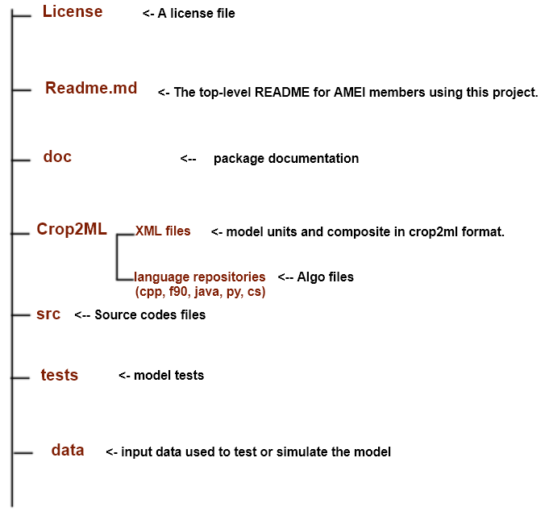

**Crop2ML Package**
===================

**Crop2ML package** is a crop modelling exchange project with a specific structure and which contains Crop2ML files as xml files and algo, the sources files, data, tests and documentation.

.. contents:: 

Crop2ML package hierarchy
^^^^^^^^^^^^^^^^^^^^^^^^^
The structure of your new project looks like this: 



Crop2ML XML files
^^^^^^^^^^^^^^^^^
Crop2ML directory contains model metadata and experiment files (XML files) of atomic models and composite model.
The name of atomic model must start with "unit_" and the name of composite model by "composition_".

Crop2ML algorithm
^^^^^^^^^^^^^^^^^
Crop2ML directory contains also a subdirectory named algo that contains for each language its repository including the file referenced in the algorithm part of xml file.
These files are neither compilable nor executable.

src directory
^^^^^^^^^^^^^
Src directory is the directory of source codes generated from the metadata of xml files and the algo files.
src contain a repository for each language and each platform which contains the code generated in the specific language or platform.

test directory
^^^^^^^^^^^^^^
Test directory contain for each language and platform the unit test of different model unit generated from xml files.

data
^^^^
Data is used to simulate the composite model.

How to add a Crop2ML package?
^^^^^^^^^^^^^^^^^^^^^^^^^^^^^
To add a crop2ML package, modeller should use Cookiecutter-Crop2ML.
| Cookiecutter-Crop2ML is a standardized template used to generate Crop2ML project structure for sharing crop models components between crops modelling platform.

 Requirements to use the cookiecutter template:
--------------------------------------------------
 - Python 2.7 or 3.5
 - [Cookiecutter Python package](http://cookiecutter.readthedocs.org/en/latest/installation.html) >= 1.4.0: This can be installed with pip by or conda depending on how you manage your Python packages:

``` bash
$ pip install cookiecutter
```

or

``` bash
$ conda config --add channels conda-forge
$ conda install cookiecutter
```
 To start a new project, run:
-----------------------------

.. code-block:: xml

    cookiecutter https://github.com/AgriculturalModelExchangeInitiative/cookiecutter-crop2ml


